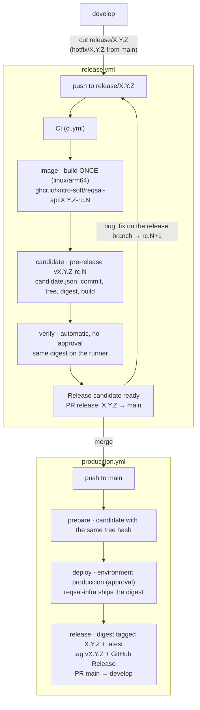

# Contributing Guide — Kntro-Soft / reqsai-api

Thanks for contributing to the **Reqs-AI** backend. This guide describes the workflow the team
follows to keep the repository organized, the history clean, and the build green.

## Table of Contents

- [Prerequisites](#prerequisites)
- [Local Setup](#local-setup)
- [Build, Run and Test](#build-run-and-test)
- [Project Structure](#project-structure)
- [Branch Structure](#branch-structure)
- [Commit Convention](#commit-convention)
- [Workflow](#workflow)
- [Pull Requests](#pull-requests)
- [Releases and Deployment](#releases-and-deployment)
- [Updating the CHANGELOG](#updating-the-changelog)

---

## Prerequisites

- **JDK 25** (the Gradle toolchain enforces the language version)
- **Docker** + Docker Compose (local PostgreSQL/pgvector)
- **openssl** (to generate dev JWT keys)
- Access to the `Kntro-Soft/reqsai-api` repository

## Local Setup

```bash
# 1. Generate the dev RSA key pair used to sign JWTs (first time only; keys are git-ignored).
./scripts/generate-jwt-keys.sh

# 2. Start PostgreSQL + pgvector.
docker compose up -d

# 3. (Optional) export the Gemini API key to exercise AI features.
export GEMINI_API_KEY=your-api-key
```

Configuration lives in `src/main/resources/application.yml` and the `dev` / `prod` / `test`
profiles. Secrets and machine-specific overrides go in a git-ignored `.env` file at the repo root
(loaded automatically via `spring.config.import`).

## Build, Run and Test

```bash
./gradlew bootRun            # run the app (dev profile) at http://localhost:8080
./gradlew build              # compile + tests + verifyModularity (full CI-equivalent build)
./gradlew test               # run the test suite
./gradlew verifyModularity   # only the Spring Modulith boundary checks
```

- Health: `http://localhost:8080/actuator/health`
- Swagger UI (dev only): `http://localhost:8080/swagger-ui.html`
- Module diagrams (generated by tests): `build/spring-modulith-docs/`

### Code quality commands

```bash
./gradlew spotlessCheck          # verify formatting (same check CI runs)
./gradlew spotlessApply          # auto-format all Java + Kotlin Gradle files
./gradlew jacocoTestReport       # coverage report at build/reports/jacoco/test/index.html
./gradlew dependencyCheckAnalyze # CVE scan (first run downloads NVD — ~5–10 min)
./gradlew test --tests "*.ArchitectureTests"  # architecture fitness functions only
```

**Formatting workflow:** The Lefthook pre-commit hook runs `spotlessApply` automatically on staged
`.java` files before each commit. If you bypass hooks (`--no-verify`), run `spotlessApply` manually
before pushing — CI will reject unformatted code via `spotlessCheck`.

**ArchUnit rules** live in `src/test/java/com/kntro/reqsai/architecture/ArchitectureTests.java`.
When you find a rule too strict for an intentional design choice, add an exemption with a
`because(...)` clause explaining the exception — do not delete the rule.

**Integration tests** must use **Testcontainers (PostgreSQL/pgvector)** rather than H2 — H2 cannot
emulate `search_path` schema-per-tenant or pgvector. Tag architecture checks with `@Tag("modularity")`.

## Project Structure

Each bounded context (`iam`, `billing`, `workspace`, `discovery`, `gateway`) is a Spring Modulith
module and is developed in hexagonal layers — `api`, `domain`, `application`, `infrastructure`,
`interfaces` — and may depend **only** on the OPEN `shared` module. Boundaries are enforced by
`ModularityTests` on every build. See the README's "Patrones transversales" section and the
[ADRs](../docs/adr/).

### Errors: each context owns its codes

`shared` provides the `ErrorCatalog` interface, the exception types (`DomainException`,
`EntityNotFoundException`, `AuthenticationException`, `InfrastructureException`) and the generic
`CommonError` codes. **Do not add context-specific codes to `shared`.** Instead, in your context's
`domain/exception` package:

```java
// iam/domain/exception/IamError.java
public enum IamError implements ErrorCatalog {
    USER_NOT_FOUND(HttpStatus.NOT_FOUND),
    EMAIL_ALREADY_EXISTS(HttpStatus.CONFLICT);
    private final HttpStatus status;
    IamError(HttpStatus status) { this.status = status; }
    public String code()       { return name(); }
    public HttpStatus status() { return status; }
}

// throw it directly...
throw new EntityNotFoundException(IamError.USER_NOT_FOUND, "User '%s' not found".formatted(id));
// ...or add a small per-context factory (IamExceptions) if you prefer.
```

The `GlobalExceptionHandler` renders any `ErrorCatalog` as an RFC 9457 `ProblemDetail` — no changes
needed in `shared` when you add a code. Use `Assert` (in `shared`) for invariant guards inside value
objects/aggregates; use Bean Validation (`@Valid`) for request DTOs.

### Auth: verification (shared) vs issuance (iam)

`shared` owns **token verification** (the `TokenVerifier` port + `JwtTokenVerifier` adapter, public key
only) because every request passes through the security filter chain. **Token issuance** (login,
refresh) belongs to `iam`: implement a `TokenIssuer` adapter there that signs with the private key
(`reqsai.jwt.private-key-path`) and exposes the `/api/v1/auth/**` endpoints.

### Conventions for bounded contexts

- **Persistence — port/adapter (hexagonal):** the `domain`/`application` layer defines a repository
  **port** (a plain interface, e.g. `UserRepository`). The `infrastructure` layer provides a JPA
  **adapter** (`JpaUserRepositoryAdapter implements UserRepository`) that delegates to an internal
  `interface JpaXxxRepository extends JpaRepository<XxxJpaEntity, UUID>` and maps entity↔domain. The
  domain never imports Spring Data. Don't let a `JpaRepository` implement the port directly.
- **Transactions — CQRS:** annotate query services with `@Transactional(readOnly = true)` (no
  dirty-checking, read-replica friendly) and override with `@Transactional` only on mutating methods.
- **Cross-module events:** publish via the aggregate (`registerEvent(...)`) and consume with
  `@ApplicationModuleListener` (Modulith transactional outbox + async + retry, backed by the
  `event_publication` table) — not a plain `@EventListener`.
- **API versioning:** controllers live under `/api/v1/...` (URL-based versioning).
- **Identifiers & base classes:** never `@GeneratedValue`. An aggregate **root** extends
  `AggregateRoot` (identity + auditing + domain events); a **non-root entity** inside an aggregate
  extends `AuditableEntity` (identity + auditing, no events, no repository). Both get a UUID v7 id in
  the constructor.
- **Soft-delete (opt-in):** do not soft-delete everything. Annotate only the aggregates that need
  recoverability with `@org.hibernate.annotations.SoftDelete(columnName = "deleted")`, add a
  `deleted boolean not null default false` column, and make affected `UNIQUE` constraints **partial**
  (`... WHERE deleted = false`). For domain lifecycle (not deletion) prefer an explicit `status`.

### Testing (pyramid)

1. **Unit** — pure domain (no Spring, no DB): value objects, aggregate rules.
2. **Slice** — `@DataJpaTest` for repository adapters, `@WebMvcTest` for controllers.
3. **Integration** — `@SpringBootTest` + **Testcontainers PostgreSQL** (`@ServiceConnection`,
   image `pgvector/pgvector:pg16` when pgvector/schema-switching is needed). The `test` profile's
   `jdbc:tc:postgresql` URL covers plain JPA ITs. Never H2 for multitenancy/pgvector.
4. **Architecture** — `ModularityTests` (`@Tag("modularity")`) runs on every build via `verifyModularity`.

#### Testing secured endpoints

Everything behind the filter chain requires an authenticated principal, so a test that just hits a
protected route gets `401`/`403`. Two helpers (in the `com.kntro.reqsai.testsupport` package) cover the two needs — no test
ever has to fake Spring Security by hand:

- **Slice / method-security** — annotate with `@WithMockReqsaiUser(role = "ROLE_ADMIN")`. It populates
  the `SecurityContext` exactly like `JwtAuthenticationFilter` (principal = `userId`, one authority =
  `role`) without minting a token. Ideal for `@WebMvcTest`.
- **End-to-end through the JWT filter** — send a real RS256 token:
  `.header("Authorization", TestJwtFactory.bearer(userId, orgId, role))`. It signs with the **committed
  throwaway test keypair** (`src/test/resources/certs`, see the README there), so the genuine
  verification path is exercised. This is what `SmokeTest.validJwtClearsTheSecurityChain` does.

Because the keypair is committed and bound by the `test` profile (`application-test.yml`, on the
**test** classpath only — never in the production jar), secured tests run on a clean checkout and in CI
with zero setup. Production keys stay git-ignored and come from env/secrets.

---

## Branch Structure

We follow **Gitflow**, and every branch starts from an issue on the
[ReqsAI project board](https://github.com/orgs/Kntro-Soft/projects/3):

| Branch                         | From      | Merges into         | Purpose                                                  |
|--------------------------------|-----------|---------------------|----------------------------------------------------------|
| `main`                         | —         | —                   | What runs in `produccion`. Every merge deploys an approved candidate, then is tagged. |
| `develop`                      | `main`    | —                   | Integration branch. All features merge here first.       |
| `feature/<issue>-<slug>`       | `develop` | `develop`           | User story or task (`feature/123-discovery-export`).     |
| `bugfix/<issue>-<slug>`        | `develop` | `develop`           | Bug found before release (`bugfix/130-tenant-leak`).     |
| `release/X.Y.Z`                | `develop` | `main`, `develop`   | Stabilization of X.Y.Z: candidates `X.Y.Z-rc.N` are built and verified here. |
| `hotfix/X.Y.Z`                 | `main`    | `main`, `develop`   | Urgent fix of production (patch version).                |

`main` and `develop` are protected by rulesets: pull request with 1 approval (stale approvals are dismissed),
the CI checks must pass, no force-push or deletion, merge commits only. CI also runs on pushes to `release/**`
and `hotfix/**`, because the release pull request is opened by a workflow and starts no `pull_request` run.
Organization admins can bypass the rules only through a pull request.

## Commit Convention

We follow [Conventional Commits](https://www.conventionalcommits.org/en/v1.0.0/):

```
<type>(<scope>): <short description in lowercase>
```

| Type       | When to use                                               |
|------------|-----------------------------------------------------------|
| `feat`     | New feature or capability                                 |
| `fix`      | Bug fix                                                   |
| `refactor` | Code change that neither fixes a bug nor adds a feature   |
| `test`     | Adding or fixing tests                                    |
| `docs`     | Documentation only (README, CHANGELOG, docs/, ADRs)       |
| `build`    | Build system or dependencies (`build.gradle.kts`, Gradle) |
| `ci`       | CI/CD configuration (GitHub Actions, Dockerfile)          |
| `chore`    | Maintenance, config, `.gitignore`                         |
| `style`    | Formatting only (no logic change)                         |
| `perf`     | Performance improvement                                   |

**Scope** = bounded context or area: `iam`, `billing`, `workspace`, `discovery`, `gateway`,
`shared`, `build`, `ci`, `config`, `db`.

**Examples:**
```
feat(iam): add JWT login endpoint and refresh token flow
fix(shared): reset search_path on connection release to prevent tenant leakage
build(deps): add testcontainers postgresql for integration tests
docs(adr): record schema-per-tenant multitenancy decision
```

## Workflow

```
1. Pick an issue in Ready on the project board (or open one with the User Story / Bug / Task forms)
   and move it to In Progress.

2. Branch from develop, naming the branch after the issue
   git checkout develop && git pull origin develop
   git checkout -b feature/123-short-slug

3. Implement, keeping the build green
   ./gradlew build

4. Commit following the convention (reference the issue in the body: "Refs #123")
   git commit -m "feat(scope): description"

5. Update CHANGELOG.md under [Unreleased]

6. Push and open a Pull Request to develop with "Closes #123"; the issue moves to In Review
   git push origin feature/123-short-slug
```

## Pull Requests

- Every PR targets `develop`; only `release/X.Y.Z` and `hotfix/X.Y.Z` target `main`.
- The description says `Closes #<issue>`, so merging closes the issue and links PR ↔ issue on the board.
- The CI checks required by the ruleset must pass, and at least **1 approval** is required (CODEOWNERS are
  requested automatically).
- Fill out the PR template honestly; do not self-merge without review.
- Keep PRs scoped to one concern where possible.

## Releases and Deployment

Releases follow **Gitflow with release candidates, model C + tag at the end** (organization guide:
[Kntro-Soft/.github CONTRIBUTING](https://github.com/Kntro-Soft/.github/blob/main/.github/CONTRIBUTING.md#releases-and-deployment)):
the image is built **once** on the release branch, verified there, and that same digest reaches production after
the merge into `main`. `vX.Y.Z` is tagged only when production succeeded.



### Traceability

```
Issue #123 ──► feature/123-slug ──► commits "Refs #123" ──► PR "Closes #123" → develop
          ──► release/X.Y.Z ──► candidate vX.Y.Z-rc.N (image digest, tree hash) ──► verification
          ──► PR "release: X.Y.Z" → main ──► produccion (same digest) ──► tag + GitHub Release vX.Y.Z
```

Every hop is a link on GitHub: the issue lists its PRs, the release notes list the PRs, each candidate is a
pre-release whose `candidate.json` records commit, tree hash, image digest, build number and the stage it passed,
the image carries `org.opencontainers.image.revision` and `org.opencontainers.image.version`, the final release
points to the `main` commit that reached production, and the `produccion` environment lists each deployment.

### Cutting a release

1. Branch `release/X.Y.Z` from `develop`. Its first commit is `chore(release): X.Y.Z`: set `version = "X.Y.Z"` in `build.gradle.kts` and
   move `[Unreleased]` in `CHANGELOG.md` to `[X.Y.Z] - date`. The pipeline refuses a branch whose version file
   does not match, and a version that is already tagged.
2. Every push to the branch runs **Release** (`release.yml`):

| Job | What it does |
|-----|--------------|
| `prepare` | Checks the branch and the version file, numbers the candidate `X.Y.Z-rc.N` (reuses N if this commit already has one), records the tree hash, reads `ENABLE_REQSAI_API_IMAGE`. |
| `ci` | Runs `ci.yml` (the same checks as a PR). |
| `image` | Builds `linux/arm64` **once** and pushes `ghcr.io/kntro-soft/reqsai-api:X.Y.Z-rc.N` and `:sha-<commit>` (labels: revision, version `X.Y.Z`, build number). |
| `candidate` | Creates the pre-release `vX.Y.Z-rc.N` on the commit with `candidate.json` (digest, tree hash, build). |
| `verify` | Automatic, no environment, not switchable: runs the digest with the `prod` profile against a fresh PostgreSQL + pgvector (every Flyway migration), then signs up, confirms the e-mail through Mailpit, signs in, reads the profile and creates an organization (`.github/scripts/verify-candidate.sh`). There is no second EC2 for a staging environment. |
| `ready` | Marks the candidate `verified` and opens or updates the PR `release: X.Y.Z` (`release/X.Y.Z → main`) with the candidate, digest and verification run. |

3. A bug found on the release branch is fixed there (`bugfix/<issue>-<slug>` from the release branch, or a direct
   commit): the next push builds `rc.N+1` and updates the PR. The version stays `X.Y.Z`.
4. Review and merge the release PR (merge commit). **Produccion** (`produccion.yml`) runs on `main`:

| Job | What it does |
|-----|--------------|
| `prepare` | Finds the newest verified candidate whose tree hash equals the `main` commit's tree. If none matches, it fails: *main differs from the tested candidate; push the change to the release branch to build a new rc*. |
| `deploy` | Environment **`produccion`: waits for approval** by `jhosepmyr`. Asks `reqsai-infra` (`deploy-mvp.yml`, `image_source=registry`) to ship that digest and waits; `reqsai-infra` dumps the database before changing the stack and does not ask for a second approval. Switch `ENABLE_REQSAI_API_DEPLOY`. |
| `release` | Only if `deploy` succeeded: tags the digest `X.Y.Z` and `latest` in GHCR (no rebuild), creates `vX.Y.Z` + GitHub Release on the `main` commit (notes = CHANGELOG section + candidate), and opens `chore: merge release X.Y.Z back into develop`. |

If `deploy` fails nothing is tagged; *Re-run failed jobs* reuses the same candidate. Move the issues to Done
when `vX.Y.Z` exists.

A hotfix is the same pipeline with `hotfix/X.Y.Z` cut from `main` (patch version).

### Rollback

**Rollback** (`rollback.yml`, *Actions → Rollback → Run workflow* from `main`, input `version`) ships the digest
recorded in the final release `vX.Y.Z` again, behind the `produccion` approval, and points `latest` at it.
Nothing is rebuilt. Versions released before this pipeline have no digest; deploy them from `reqsai-infra`
(`deploy-mvp.yml` with `image_source=build`).

**Database.** Flyway migrations only move forward. `reqsai-infra` dumps PostgreSQL on the host right before it
changes the stack. If the version being rolled back already ran a migration the older image does not understand,
restore that dump first (`sudo /usr/local/sbin/reqsai-restore /var/backups/reqsai/reqsai-<timestamp>.dump`,
section 14.4 of the reqsai-infra deploy guide), then fix forward with `hotfix/X.Y.Z`.

### Deploy switches

Organization variables in *Kntro-Soft → Settings → Secrets and variables → Actions → Variables*; only `true`
turns a channel on, and the run summary says which variable stopped a job. Verification is never switchable.

| Variable | Controls |
|----------|----------|
| `ENABLE_REQSAI_API_IMAGE` | Job `image` of `release.yml` (off: CI only, no candidate, so no release). |
| `ENABLE_REQSAI_API_DEPLOY` | Job `deploy` of `produccion.yml` and `rollback.yml` (off: no deploy and no tag). |
| `ENABLE_REQSAI_INFRA_DEPLOY` | Every deploy to the MVP host, in `reqsai-infra`. If it is off the infra run skips the deploy and the `deploy` job here fails. |

### One-time set-up

- Environment `produccion`: required reviewer `jhosepmyr`, deployment branches **`main` only**.
- `INFRA_DEPLOY_TOKEN`: fine-grained PAT with *Actions: read and write* on `Kntro-Soft/reqsai-infra` only. Prefer
  storing it as a secret of the `produccion` environment, so only an approved job can use it.
- *Settings → Actions → General → Allow GitHub Actions to create and approve pull requests* (organization and
  repository), so the workflows can open the release and back-merge PRs. While it is off, the run prints the
  compare link and the title to open them by hand.
- GHCR: the first `release.yml` run creates the package `reqsai-api` linked to this repository. Grant
  `reqsai-infra` **Read** in *Package settings → Manage Actions access* (or make the package public).
- The `main` ruleset must not require a `produccion` deployment of the PR head any more (production runs after
  the merge); require the check `Release candidate ready` instead.

## Updating the CHANGELOG

Add your change under `## [Unreleased]` in [`CHANGELOG.md`](../CHANGELOG.md) following
[Keep a Changelog](https://keepachangelog.com/en/1.1.0/):

```markdown
## [Unreleased]
### Added
- iam: JWT authentication endpoints
### Fixed
- shared: tenant search_path leak on connection release
```
